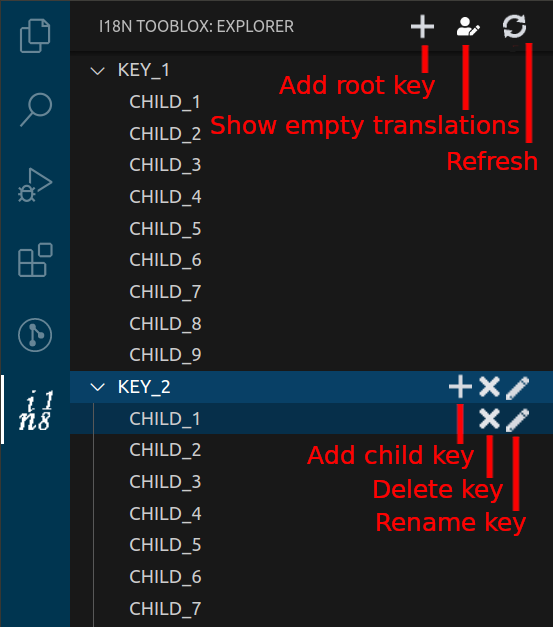
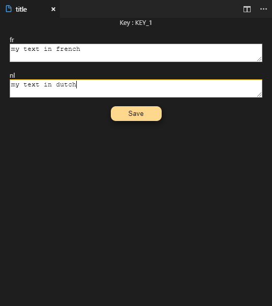
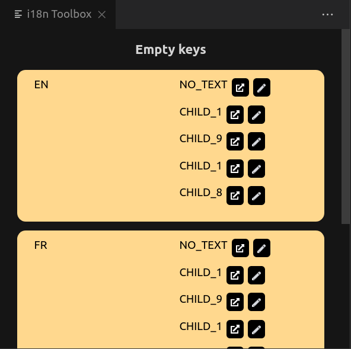

# i18n-toolbox

Extension vs code which allows to be more productive with i18n

# Configuration

You can add a configuration file with the name 'i18n-toolbox.json' :

```

{
"searchI18nFile": false,
"i18nFolder": "src/assets/i18n",
"defaultLanguage": "en",
"writeMissingKey": true
}

```

If you don't add a configuration file, the default behavior is to search all files in the workspace with the name \*.i18n.json and take the first in [the default language](#the-default-language).

Else it searches files in the i18nFolder.

if there are no key 'defaultLanguage', the default language is the first it finds.

if writeMissingKey is true, the extension will add when refreshing all the keys of the default language in other languages with the empty string value.

## The default language

If there are some missing keys in another language, i18n take the traduction in the default language.

# Features

On every file update, the JSON will be sorted alphabetically.

## On the side bar view



Actions :

-   Add root key

-   Refresh

-   Add child key

-   Rename key

-   Delete key

-   Show empty translations

## In the edit panel

When you click on the key in the tree-view, the edit panel appears. You can see the full path of the key, and the text in each language.



You can edit the text in each language and save it.

## In the empty translations panel



You can see all the empty translations of each file. For each key, you can be redirected to the file or open the edit panel for this translation.

# Soon..

## Search bar

A search bar which allows to search text and key on the json file.

## tooltip on hover the i18n path

When there is a i18n key, you can see the translation in each language on hover.
